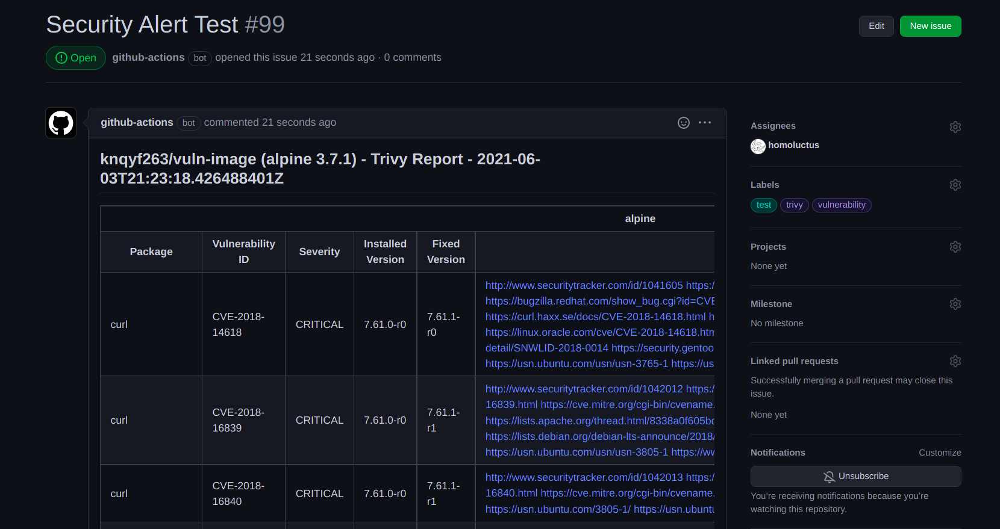

# Gitrivy (GitHub Issue + Trivy Action)


This is a GitHub Actions to scan vulnerability using [Trivy](https://github.com/aquasecurity/trivy).<br>
If vulnerabilities are found by Trivy, it creates the following GitHub Issue.



## Inputs

|Parameter|Required|Default Value|Description|
|:--:|:--:|:--:|:--|
|token|True|N/A|GitHub Access Token.<br>${{ secrets.GITHUB_TOKEN }} is recommended.|
|image|True|N/A|The target image name to scan the vulnerability<br>Specify this parameter or `IMAGE_NAME` environment variable|
|trivy_version|False|latest|Trivy version|
|severity|False|HIGH,CRITICAL|Severities of vulnerabilities (separated by commma)|
|vuln_type|False|os,library|Scan target are os and / or library (separated by commma)|
|ignore_unfixed|False|false|Ignore unfixed vulnerabilities<br>Please specify `true` or `false`|
|template|False|N/A|Trivy --template option<br>By default, it uses src/template/default.tpl which is based on [contrib/html.tpl](https://github.com/aquasecurity/trivy/blob/main/contrib/html.tpl)<br>reference: [Report Formats - Trivy](https://aquasecurity.github.io/trivy/v0.18.3/examples/report/#template)|
|issue_title|False|Security Alert|Issue title|
|issue_label|False|trivy,vulnerability|Issue label (separated by commma)|
|issue_assignee|False|N/A|Issue assignee (separated by commma)|
|fail_on_vulnerabilities|False|false|Whether the action should fail if any vulnerabilities were found.|

## Outputs

|Parameter|Description|
|:--:|:--|
|html_url|The URL to view the issue|
|issue_number|The created issue number|

## Example

Detect your docker image vulnerability everyday at 9:00 (UTC).

```yaml
name: Vulnerability Scan

on:
  schedule:
    - cron: '0 9 * * *'

jobs:
  scan:
    name: Daily Vulnerability Scan
    runs-on: ubuntu-latest
    steps:
      - name: Pull docker image
        run: docker pull sample

      - uses: lazy-actions/gitrivy@v2
        with:
          token: ${{ secrets.GITHUB_TOKEN }}
          image: sample
```
